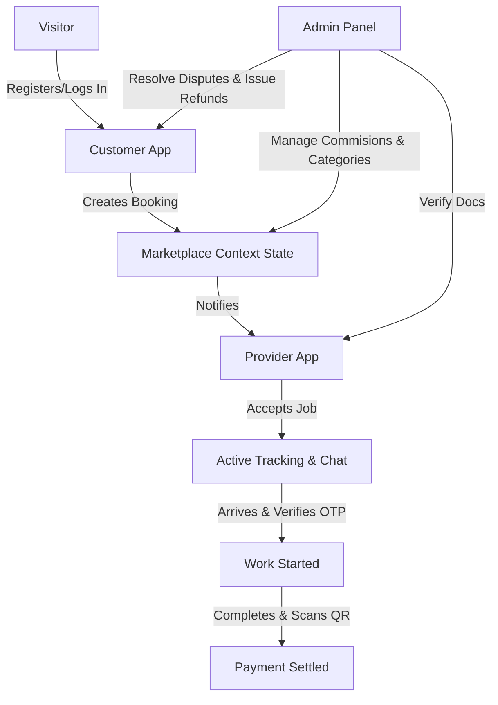

# 🛠️ ServiceHub - On-Demand Local Services Marketplace

ServiceHub is a premium, fully-featured, and highly animated simulated marketplace for local services. The application allows users to experience the entire lifecycle of an on-demand services platform—bridging the gap between **Customers** seeking services, **Service Providers** completing jobs, and **Admins** managing the platform.

Equipped with dynamic simulations like **Live Map Tracking**, **Video Calls**, **Voice Search**, and an interactive **Role Hot-Swap controller**, ServiceHub showcases a modern, responsive interface built with React.js and styled entirely with high-performance Vanilla CSS.

---

## 🚀 How to Run the Project

Follow these simple steps to set up and run ServiceHub locally on your machine.

### Prerequisites
Make sure you have [Node.js](https://nodejs.org/) installed (version 16 or above recommended).

### 1. Install Dependencies
Navigate to the project directory and install the required npm packages:
```bash
npm install
```

### 2. Start the Development Server
Launch the Vite development server:
```bash
npm run dev
```

### 3. Access the Application
Open your web browser and navigate to the address shown in the terminal, usually:
* **Local:** `http://localhost:5173/`

### 4. Build for Production (Optional)
To generate a production-ready build:
```bash
npm run build
```
To preview the production build locally:
```bash
npm run preview
```

---

## ⚙️ How It Works (System Architecture & Personas)

ServiceHub simulates a complete marketplace transaction loop. You can switch between roles instantly using the floating **Simulator Persona Controller** (represented by the ⚙️ floating gear button in the bottom right corner).



### 👥 The Three Personas

#### 1. 🧑‍💻 Visitor & Customer App
* **Visitor Mode:** Users can browse categories (Electrician, Plumber, Carpenter, Beauty, AC Repair, etc.), view promotional banners, read reviews, and inspect provider profiles.
* **Onboarding:** Features an interactive login flow simulating OTP verification.
* **Customer Portal:**
  * **Simulated Wallet:** Load funds, track debits/credits, and view real-time balance.
  * **Booking Flow:** Book providers for specific dates/time slots with detailed descriptions.
  * **Real-time Timeline Tracking:** Monitor bookings as they progress from `requested` ➡️ `accepted` ➡️ `dispatched` ➡️ `started` ➡️ `completed`.
  * **Interactive Simulators:**
    * 🗺️ **Live Map Tracking:** Watch the provider's vehicle move in real-time towards the customer address.
    * 📞 **Video Call & Chat Simulator:** Start a live video call or text chat with the provider or customer support.
    * 🎙️ **Voice Search Simulator:** Simulate speech-to-text search inputs.
  * **Disputes & Feedback:** Open support tickets/disputes if work is unsatisfactory or write reviews with simulated photo attachments.

#### 2. 💼 Service Provider Portal
* **Registration:** Providers can register their profiles, select a service category, set hourly charges, and upload mock verification documents (Aadhaar & PAN cards).
* **Job Management Console:**
  * View incoming booking requests with client details.
  * Accept/Reject bookings.
  * Dispatch status updates (On the way).
  * **OTP Verification:** Start jobs securely by entering the 4-digit security code generated and shown on the Customer's app screen.
  * **QR Code Completion:** Complete jobs and settle payments by scanning a simulated QR code.
* **Profile Management:** Update hourly rates and add portfolio images to their work gallery.

#### 3. 🛡️ Admin Dashboard (Control Center)
* **Real-Time Analytics:** Track key metrics such as Total platform revenue, commissions earned, provider payouts, active bookings, and dispute rates.
* **Provider Verification:** Review uploaded Aadhaar and PAN documents to approve/reject pending registrations.
* **Commission & Categories Control:** Add, edit, or delete service categories and adjust platform commission percentages dynamically.
* **Promotional Banner Manager:** Create, enable, or disable discount banner ads displayed to customers.
* **Dispute Resolver:** Review customer complaints and resolve them, including the ability to trigger a full refund directly to the customer's wallet.

---

## 📁 Project Directory Structure

```text
├── public/                     # Static assets & SVG Sprite Sheet
├── src/
│   ├── assets/                 # Local images & brand resources
│   ├── components/
│   │   ├── Header.jsx          # Marketplace header & user settings
│   │   ├── CustomerApp.jsx     # Customer interface, booking, wallet, support
│   │   ├── ProviderApp.jsx     # Provider job panel, registration, profile settings
│   │   ├── AdminPanel.jsx      # Admin platform analytics & management controls
│   │   ├── LiveTrackingMap.jsx # Simulated real-time navigation & route tracking
│   │   ├── VideoCallSimulator.jsx # Mock face-to-face video calling system
│   │   └── VoiceSearchSimulator.jsx # Mock voice control search interface
│   ├── context/
│   │   └── MarketplaceContext.jsx # Central state management & actions
│   ├── App.jsx                 # Entry point, role coordinator
│   ├── index.css               # Design system token variables & global styling
│   └── main.jsx                # React mount setup
├── package.json
└── vite.config.js
```

---

## 🛠️ Technology Stack & Libraries

* **Core Framework:** React.js (v19)
* **Bundler & Dev Server:** Vite
* **State Management:** React Context API (custom hook: `useMarketplace`)
* **Styling:** Vanilla CSS with HSL design variables (incorporating fluid animations, glassmorphism, responsive grid systems, and custom transitions)
* **Icons:** [Lucide React](https://github.com/lucide/lucide-react)

---

## 🏆 Key Design & Animation Highlights

* **Visual Excellence:** Clean, dark/light theme options using harmonized color palettes and standard modern typography (Inter/Outfit).
* **Micro-Animations:** Interactive hovering, loading animations, shifting timelines, and slide-in alerts to enhance user feedback.
* **Responsive Layout:** Designed to look and function perfectly across desktop monitors, tablets, and mobile screens.
